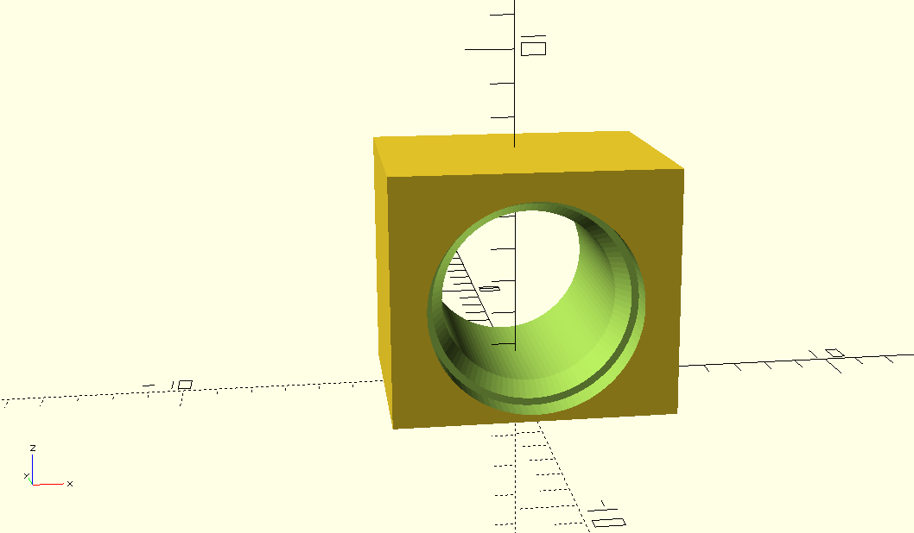
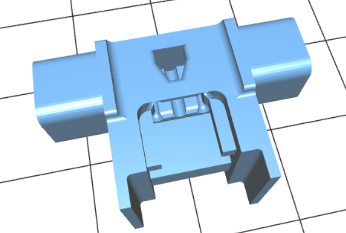
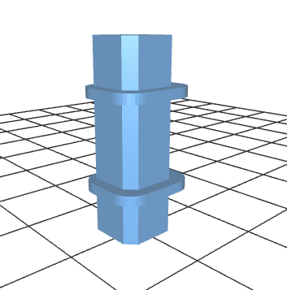
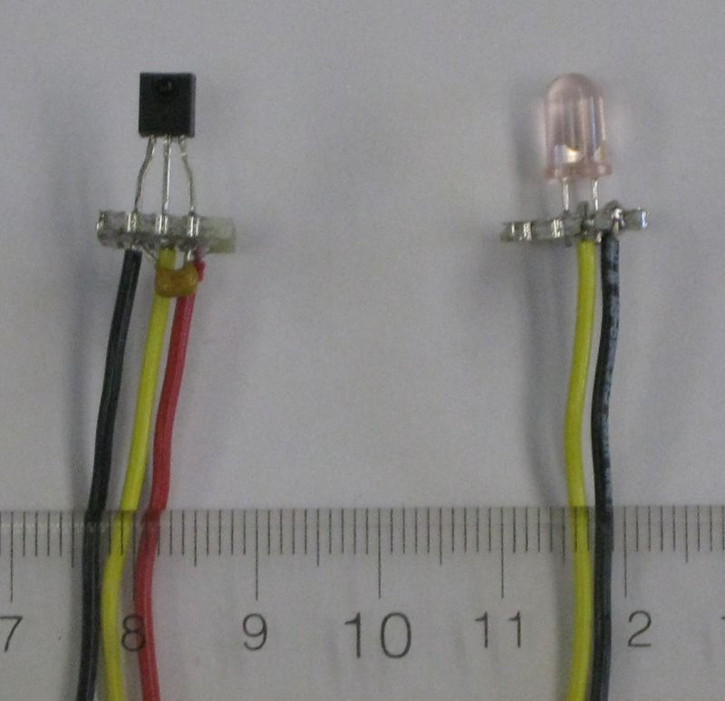
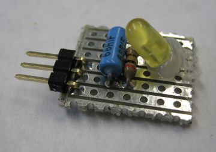
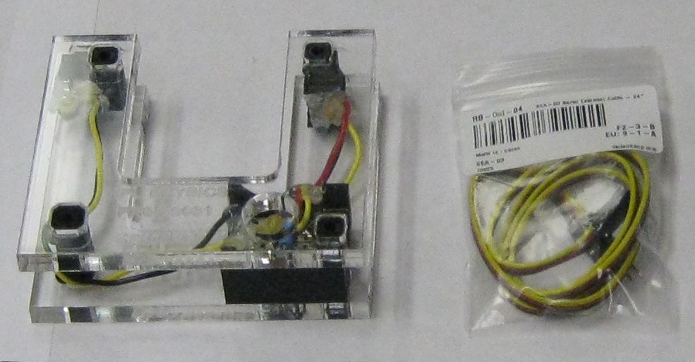
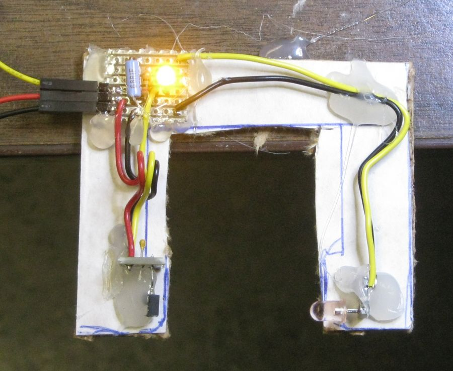
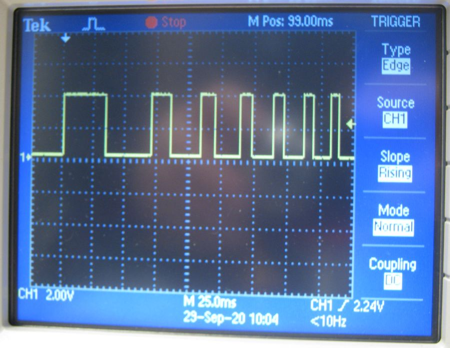
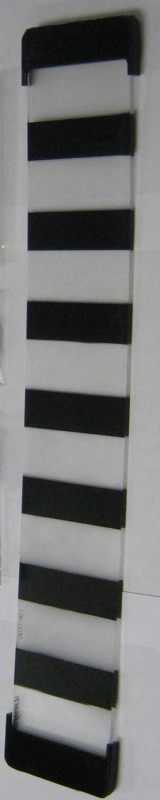

# Photogate

## Component holders

The component holders provide a support to hold components in possition in the correct orientation consistently.
STL files created by Micheal Chernoff using solidworks.

### IRED holder

The first component holder is for the IR emitting diode.

* [STL file for IR emitter diode holder](IRED_holder.STL) -- click link to view interactive model

view from one angle below:

### Sensor Holder

* [STL file for IR Sensor Holder](IR_sensor_mount.STL) -- click link to view interactive model

view from one angle below:

### Junction Board holder

* [STL file for Junction Board holder](junction_board_mount_mount.STL) -- click link to view interactive model

view from one angle below:

### Support Post

* [STL file for Support Post](wire_support_pin.STL) -- click link to view interactive model

view from one angle below:

## Photos of Parts

### IR Sensor and IR emitting diode mounted on a boards.

### Junction Board

## Base Part

*{working on this}*

## Photogate with Cable

### Mock-up Photogate

The wiring on the Mock-up was more visible.

### Signal on DSO

Signal obtained when picket fence was dropped through photogate.
The Picket fence was released from rest in a position where the photogate 
beam was between the leading bumper and first black strip.

#### The Picket Fence

