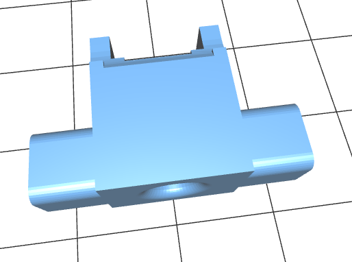

# Photogate

## Component holders

The component holders provide a support to hold components in possition in the correct orientation consistently.

### IRED holder

The first component holder is for the IR emitting diode.

* [STL file for IR emitter diode holder](IRED-holder.stl)

Click on link above for interactive 3D image of part. Note it is incomplete. Will add pin that will fit into hole in base part.

A view of the part from one angle shown here.

A rotated view with a simplified version of the IRED added (I did not bother creating the dome shape at the emitting end.

### Senser Holder

*Still to come*

## Base Part

*Still to come*
